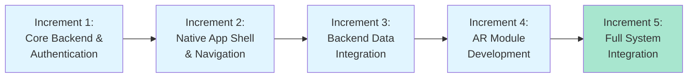
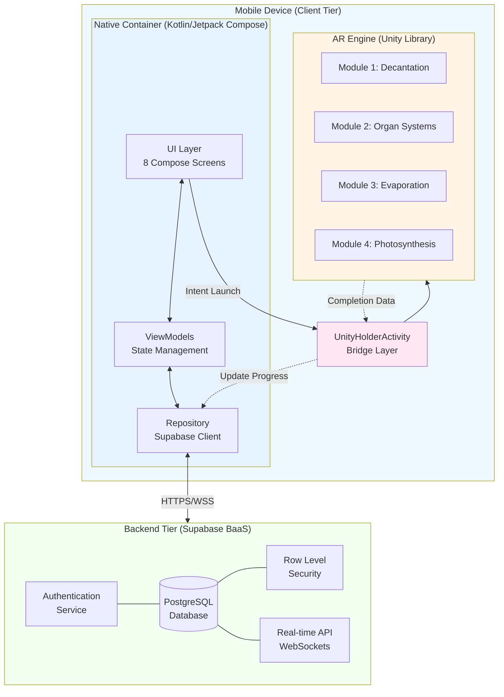
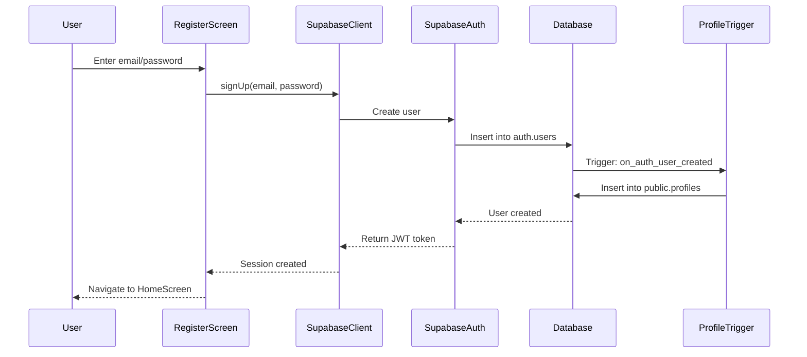
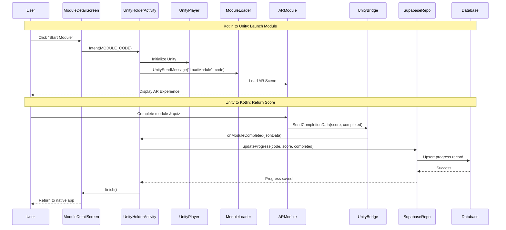

# Chapter 3: Methodology

## 3.1 Introduction

The primary goal of this project was to create "Project E.S.C.A.P.E." (Engaging Students through Collaborative Augmented Reality for Practical Education), a functional, data-driven mobile application designed to enhance science learning through Augmented Reality (AR) technology. The application aims to transform traditional science education by providing immersive, interactive learning experiences that allow students to visualize and interact with complex scientific concepts in real-time.

The purpose of this chapter is twofold: first, to detail the **software development methodology**, system architecture, and technical implementation strategies employed to build the application; and second, to outline the **research methodology** used to evaluate the system's educational impact and usability. Given the complexity of integrating multiple advanced technologies—including native Android development, AR visualization, and cloud-based backend services—a systematic and structured approach was essential to ensure successful project completion and rigorous evaluation.

This chapter is organized into two major parts. **Part I (Software Methodology)** describes the Incremental Development Model that guided the development process, the final system architecture, the technology stack selected for each component, and comprehensive implementation details for the backend, native application, and AR modules. **Part II (Research Methodology)** outlines the research design, participant selection, data collection instruments, and statistical methods used to evaluate the system's effectiveness in enhancing student learning outcomes and user satisfaction.

---

## PART I: SOFTWARE METHODOLOGY

## 3.2 Incremental Development Methodology

### 3.2.1 Model Selection

The **Incremental Development Model** was explicitly chosen as the primary software development methodology for this project. Unlike waterfall or purely iterative approaches, incremental development allows for the system to be designed, implemented, and deployed in discrete functional units (increments), with each increment adding new capabilities to the existing system. This model supports the repeated addition of requirements until the software is completed, making it particularly suitable for complex, multi-domain projects.

This model is particularly well-suited for projects that:
- Involve multiple, distinct technological domains
- Require continuous validation of integration points
- Benefit from early detection of architectural or integration issues
- Need to maintain a working system at each stage of development
- Allow for gradual testing and refinement of features

### 3.2.2 Justification for Model

The selection of the Incremental Development Model was driven by three critical factors specific to this project:

**1. Managing Complexity**

Project E.S.C.A.P.E. integrates three fundamentally different technology stacks:
- **Native Android development** using Kotlin and Jetpack Compose for the user interface
- **Backend-as-a-Service (BaaS)** using Supabase for authentication, data persistence, and real-time synchronization
- **AR visualization engine** using Unity for 3D rendering and interactive learning modules

Each of these components operates on different principles and requires specialized knowledge. An incremental approach allowed the development team to focus on mastering and implementing one component at a time, ensuring stability before moving to the next layer of complexity.

**2. Risk Reduction**

The most technically challenging aspect of the project was the **Kotlin-Unity integration**—a relatively uncommon architectural pattern that involves embedding Unity as a library within a native Android application. By deferring this integration to a later increment (after both the native app and Unity modules were independently functional), the project minimized the risk of cascading failures and allowed for isolated troubleshooting of the bridge layer.

Additionally, starting with authentication and backend infrastructure in the first increment ensured that fundamental security and data management concerns were addressed before building higher-level features.

**3. Testability and Validation**

Each increment produced a **functional, testable piece of the system**. This meant that:
- The authentication system could be validated independently before adding module functionality
- The native app's navigation and UI could be tested with mock data before connecting to the backend
- Unity AR modules could be developed and refined as standalone experiences before integration
- Each integration point could be tested in isolation

This approach provided continuous validation of requirements and allowed for early user feedback on core functionality.

### 3.2.3 Development Increments

The development of Project E.S.C.A.P.E. was divided into **five logical increments**, each with a specific goal, set of features, and measurable outcome. Figure 3.2 illustrates the sequential progression of these increments.



**Figure 3.2:** Incremental development progression showing the five sequential development phases.

#### **Increment 1: Core Backend & Authentication**

**Goal:** Establish a secure, scalable backend infrastructure with user authentication.

**Features Implemented:**
- Configured Supabase project with PostgreSQL database
- Designed and implemented the initial database schema:
  - `profiles` table: Stores user information (id, email, full_name, role, created_at)
  - Implemented role-based differentiation (student vs. teacher/admin)
  - Set up foreign key relationships with Supabase Auth
- Implemented user authentication flows:
  - User registration (Sign Up) with email/password
  - User login with session management secured by JSON Web Tokens (JWTs)
  - Password reset functionality
- Configured Row Level Security (RLS) policies to ensure data privacy
- Implemented Role-Based Access Control to differentiate between students and teachers/admins
- Created basic API endpoints for profile management

**Outcome:** A fully functional authentication system with secure backend infrastructure. Users could register, log in, and have their data stored securely with proper access controls based on their role.

**Testing:** Manual testing of signup/login flows, database constraint validation, and RLS policy enforcement.

---

#### **Increment 2: Native App Shell & Navigation**

**Goal:** Build the complete user interface and navigation structure for the native Android application.

**Features Implemented:**
- Developed 8 primary screens using Jetpack Compose:
  1. **SplashScreen:** Application initialization and auto-login
  2. **LoginScreen:** User authentication interface
  3. **RegisterScreen:** New user account creation
  4. **HomeScreen:** Dashboard with statistics and quick actions
  5. **ModulesScreen:** Grid view of available learning modules
  6. **ModuleDetailScreen:** Detailed information about each module
  7. **ProgressScreen:** User's learning progress and achievement history
  8. **ProfileScreen:** User profile management and settings
- Implemented bottom navigation bar for seamless screen transitions
- Designed and applied consistent UI/UX theme (color palette, typography, spacing)
- Created ViewModel architecture for state management (using static/mock data)
- Implemented proper navigation graph with Jetpack Compose Navigation

**Outcome:** A fully navigable, high-fidelity native Android application with polished UI. All screens were functional and demonstrated the complete user journey, though data was not yet connected to the backend.

**Testing:** UI/UX testing for navigation flows, screen transitions, and visual consistency across different device sizes.

---

#### **Increment 3: Backend Data Integration**

**Goal:** Connect the native UI to the live Supabase backend for real-time data synchronization.

**Features Implemented:**
- Extended database schema with the `progress` table:
  - Columns: user_id, module_code, best_score, completed, created_at, updated_at
  - Foreign key relationship to profiles table
  - Indexes for query optimization
- Created additional tables for comprehensive content management:
  - `modules` table: Stores module information and metadata
  - `lessons` table: Contains lesson content for each module
  - `quiz_questions` table: Stores assessment questions and correct answers
- Integrated Supabase Kotlin client into the native app
- Implemented SupabaseRepository pattern for data access:
  - Real-time data fetching from profiles and progress tables
  - Progress tracking and score updates
  - Module completion status management
- Connected each screen to live data:
  - **HomeScreen:** Real-time statistics (total modules, completed count, average score)
  - **ModulesScreen:** Dynamic module list with completion status
  - **ProgressScreen:** User's historical progress data
  - **ProfileScreen:** Live user profile information
- Implemented data caching and offline capability considerations
- Added loading states and error handling for network operations

**Outcome:** A fully data-driven native application. All user interactions were now persisted to the database, and the UI reflected real-time changes in user progress and profile data.

**Testing:** Integration testing of CRUD operations, real-time sync validation, and RLS policy verification.

---

#### **Increment 4: AR Module Development (Standalone)**

**Goal:** Create four interactive, educational AR experiences in Unity.

**Features Implemented:**
- Developed four distinct Unity scenes, each representing a science learning module:
  1. **Decantation Module:** Interactive demonstration of liquid-solid separation
  2. **Organ Systems Module:** 3D visualization of human body systems
  3. **Evaporation Module:** Simulation of phase change and molecular movement
  4. **Photosynthesis Module:** Interactive plant cell and light energy processes
- For each module:
  - Designed and implemented 3D models and AR markers
  - Created interactive elements (e.g., draggable objects, clickable hotspots)
  - Developed quiz or assessment mechanisms to evaluate understanding
  - Implemented scoring logic based on correctness and completion time
  - Added instructional UI overlays and feedback systems
- Configured AR Foundation for Android device compatibility
- Optimized 3D assets for mobile performance

**Outcome:** Four complete, standalone AR learning experiences. Each module could be tested independently on Android devices, providing immersive educational content with built-in assessment.

**Testing:** User testing of AR tracking stability, quiz functionality, and educational effectiveness on multiple Android devices.

---

#### **Increment 5: Full System Integration (Kotlin-Unity Bridge)**

**Goal:** Connect the native Kotlin application to the Unity AR modules for a seamless end-to-end experience.

**Features Implemented:**
- Implemented **Unity as a Library (UaaL)** architecture:
  - Configured Unity project to export as an Android library (AAR)
  - Integrated Unity library into the Kotlin project's Gradle build
- Created `UnityHolderActivity.kt`:
  - Custom Android Activity to host the Unity view and serve as the bridge layer
  - Manages Unity lifecycle (initialization, pause, resume, destruction)
  - Handles screen orientation and system UI integration
- Implemented **Kotlin to Unity** data passing:
  - From `ModuleDetailScreen`, launch `UnityHolderActivity` with Intent extras
  - Pass `module_code` parameter to Unity to determine which scene to load
  - Unity C# script reads the intent data and loads the appropriate module
- Implemented **Unity to Kotlin** data returning:
  - C# script in Unity calls native Android methods via `UnitySendMessage`
  - On module completion, Unity sends back:
    - `module_code`: Identifier of the completed module
    - `score`: User's assessment score (0-100)
    - `completion_status`: Boolean indicating successful completion
  - `UnityHolderActivity` receives the data and updates Supabase `progress` table
- Added error handling for bridge communication failures
- Implemented progress indicators and loading states during Unity initialization

**Outcome:** The fully functional "Project E.S.C.A.P.E." application. Users could now:
1. Log in to the native app
2. Browse available modules
3. Launch an AR module from the native UI
4. Complete the AR experience and assessment
5. Have their score and progress automatically saved to their profile
6. Return to the native app to see updated statistics and progress

**Testing:** End-to-end integration testing of the complete user flow, data persistence validation, and stress testing of the Kotlin-Unity bridge under various scenarios.

---

## 3.3 System Architecture

The incremental development process culminated in a **Three-Tier Architecture combined with a Hybrid Client** design. This architecture effectively separates concerns between presentation, business logic, and data management while supporting the unique requirement of embedding an AR engine within a native mobile application.

### 3.3.1 Architectural Overview

The system consists of three primary tiers:

**Client Tier (Mobile Device):**
- **Native Container (Kotlin/Jetpack Compose):** Manages the primary user interface, application state, navigation, and all communication with the backend services.
- **AR Engine (Unity):** Embedded as a library/activity within the native app, responsible for rendering 3D/AR content and handling interactive learning experiences.

**Backend Tier (Backend-as-a-Service):**
- **Supabase:** Provides authentication services, PostgreSQL database with real-time synchronization, and automatic API generation with Row Level Security.
- **Database Schema:** The database includes key tables:
  - `profiles`: Stores user data including role designation (student/teacher)
  - `progress`: Tracks user performance per module (best_score, completion status)
  - `modules`: Contains module information and metadata
  - `lessons`: Stores lesson content for each module
  - `quiz_questions`: Contains assessment questions and correct answers

**Data Flow:**
- **Kotlin ↔ Supabase:** RESTful API calls and real-time WebSocket connections for authentication, profile management, and progress tracking.
- **Kotlin ↔ Unity:** Intent-based communication for launching AR modules and callback mechanisms for receiving completion data.
- **Security:** Authentication uses email/password access secured by JSON Web Tokens (JWTs), with Role-Based Access Control differentiating between students and teachers/admins. All data access is governed by Row Level Security (RLS) policies at the database level.

### 3.3.2 System Architecture Diagram

Figure 3.3 illustrates the complete system architecture, showing the interactions between the client-side components (Native Container and AR Engine) and the backend services.



**Figure 3.3:** System Architecture Diagram showing the three-tier hybrid architecture with native container, embedded AR engine, and cloud backend.

### 3.3.3 Architectural Benefits

This architectural design provides several key advantages:

1. **Separation of Concerns:** The native container handles navigation and data management, while Unity focuses solely on AR rendering and interaction.

2. **Scalability:** The BaaS backend (Supabase) can scale independently of the client application, and additional AR modules can be added without restructuring the native app.

3. **Maintainability:** Each tier can be developed, tested, and updated independently, reducing the risk of introducing bugs across the system.

4. **Performance:** Unity runs as a native library (not a WebView), ensuring optimal AR performance, while Jetpack Compose provides smooth native UI rendering.

5. **Security:** All data access is controlled through Supabase's RLS policies, ensuring that users can only access their own data, even if API calls are intercepted.

---

## 3.4 Technology Stack

The technology stack was carefully selected to balance performance, development efficiency, and long-term maintainability. Each component was chosen based on its suitability for the specific requirements of Project E.S.C.A.P.E. Table 3.1 summarizes the complete technology stack.

**Table 3.1:** Development Tools and Technologies

| Component | Technology Stack | Justification/Role |
|-----------|-----------------|-------------------|
| Native Frontend | Kotlin with Jetpack Compose | Official language for Android development, offering modern language features (null safety, coroutines), declarative UI paradigm for high performance, and reduced boilerplate code |
| AR Engine | Unity with AR Foundation (C#) | Industry-standard platform for 3D/AR creation; essential for Unity as a Library (UaaL) integration capability; cross-platform AR framework |
| Backend/Database | Supabase (PostgreSQL) | Open-source BaaS with built-in authentication, robust relational database structure, real-time capabilities via WebSockets, and cost-effectiveness for educational projects |
| Web Admin Panel | TypeScript/JavaScript (React/Next.js) | Used to build responsive administrative panel for teachers/admins to manage content, monitor student progress, and view analytics |
| Version Control | Git and GitHub | Source code management and collaboration platform for coordinating team work and tracking changes |
| Build System | Gradle with Kotlin DSL | Android project build automation with dependency management |
| Networking | Ktor client (Supabase SDK) | HTTP communication for backend API calls |
| Asynchronous Programming | Kotlin Coroutines | Non-blocking operations for smooth UI performance |

### 3.4.1 Native Frontend: Kotlin with Jetpack Compose

**Technology:** Kotlin programming language with Jetpack Compose UI toolkit

**Justification:**

Kotlin is the officially recommended language for Android development, offering:
- **Modern language features:** Null safety, coroutines for asynchronous programming, extension functions, and data classes
- **Interoperability:** Seamless integration with Java libraries and Android SDK
- **Tooling support:** Excellent IDE support in Android Studio with advanced debugging and profiling

Jetpack Compose was chosen as the UI framework because it:
- **Declarative UI paradigm:** Simplifies UI development by describing "what" the UI should look like rather than "how" to build it
- **Reduced boilerplate:** Eliminates the need for XML layouts and findViewById calls
- **State management:** Built-in state hoisting and recomposition make it easier to build reactive UIs
- **Modern and future-proof:** Compose is Google's long-term vision for Android UI development
- **Performance:** Compiled Kotlin with optimized recomposition provides excellent runtime performance

**Alternatives Considered:**
- XML-based layouts (rejected due to verbosity and maintenance overhead)
- Flutter (rejected because it would complicate Unity integration)
- React Native (rejected due to performance concerns for AR integration)

---

### 3.4.2 AR Engine: Unity

**Technology:** Unity 2021+ with AR Foundation

**Justification:**

Unity is the industry-standard platform for creating interactive 3D and AR experiences, chosen for:
- **Unity as a Library (UaaL):** Unique capability to embed Unity as a library within a native Android app, allowing seamless integration with Kotlin
- **AR Foundation:** Cross-platform AR framework that abstracts ARCore (Android) and ARKit (iOS), making the project potentially expandable to iOS
- **Rich ecosystem:** Extensive Asset Store, community support, and documentation for AR development
- **Visual development:** Scene-based workflow and visual editor accelerate 3D content creation
- **Performance:** Highly optimized rendering engine for mobile devices
- **C# scripting:** Powerful, well-documented scripting API for implementing game logic and interactivity

**Alternatives Considered:**
- ARCore SDK directly in Kotlin (rejected due to development complexity and lack of visual editor)
- Wikitude (rejected due to licensing costs)
- Vuforia (rejected due to marker-based limitations)

---

### 3.4.3 Backend: Supabase (PostgreSQL)

**Technology:** Supabase open-source Backend-as-a-Service with PostgreSQL database

**Justification:**

Supabase was selected as the backend platform because it provides:
- **Authentication out-of-the-box:** Built-in email/password authentication, session management, and password reset flows
- **PostgreSQL database:** Robust, open-source relational database with ACID compliance
- **Real-time subscriptions:** WebSocket-based real-time data synchronization for live updates
- **Row Level Security (RLS):** Database-level security policies that ensure users can only access their own data
- **Auto-generated APIs:** RESTful and GraphQL APIs generated automatically from database schema
- **Open-source:** No vendor lock-in; can be self-hosted if needed
- **Developer experience:** Intuitive dashboard, comprehensive documentation, and official Kotlin client library
- **Cost-effective:** Generous free tier suitable for educational projects

**Alternatives Considered:**
- Firebase (rejected due to preference for PostgreSQL over NoSQL)
- Custom Node.js backend (rejected due to development time constraints)
- AWS Amplify (rejected due to complexity and cost)

---

### 3.4.4 Additional Tools and Libraries

**Version Control:** Git with GitHub for source code management and collaboration

**Build System:** Gradle with Kotlin DSL for Android project build automation

**Dependency Injection:** Hilt (not implemented in current version, but recommended for future scaling)

**Networking:** Ktor client (included in Supabase SDK) for HTTP communication

**Asynchronous Programming:** Kotlin Coroutines for non-blocking operations

**Testing:** JUnit and Espresso (prepared for future unit and UI testing)

---

## 3.5 Implementation Details

This section provides a detailed overview of the technical implementation for each component of the system, organized by architectural tier.

### 3.5.1 Backend Implementation (Supabase)

#### **3.5.1.1 Authentication**

Supabase Auth was configured to handle user authentication flows:

**Sign Up:**
- Users provide email and password through the `RegisterScreen`
- The Supabase client calls `supabase.auth.signUp(email, password)`
- Upon successful registration:
  - A new user is created in the `auth.users` table (managed by Supabase)
  - A trigger automatically creates a corresponding entry in the public `profiles` table
  - A session token (JWT) is returned to the client

**Login:**
- Users provide credentials through the `LoginScreen`
- The client calls `supabase.auth.signInWithPassword(email, password)`
- Upon successful authentication:
  - A session is created with access and refresh tokens
  - Tokens are securely stored in encrypted SharedPreferences
  - User is navigated to the `HomeScreen`

**Session Management:**
- Access tokens expire after 1 hour; refresh tokens are valid for 30 days
- The app automatically refreshes tokens before expiration
- On app restart, `SplashScreen` checks for valid session and auto-logs in

**Security Features:**
- Passwords are hashed using bcrypt before storage
- Email verification can be enabled for additional security
- Password reset via email is supported through Supabase's built-in flows

Figure 3.4 illustrates the complete authentication flow from user registration to profile creation.



**Figure 3.4:** User registration and authentication flow showing the interaction between client, Supabase Auth, and database triggers.

---

#### **3.5.1.2 Database Schema**

The database consists of two primary tables:

**`profiles` Table:**

| Column       | Type         | Constraints                  | Description                    |
|--------------|--------------|------------------------------|--------------------------------|
| id           | UUID         | PRIMARY KEY, REFERENCES auth.users(id) | User's unique identifier       |
| email        | TEXT         | NOT NULL, UNIQUE             | User's email address           |
| full_name    | TEXT         | NOT NULL                     | User's display name            |
| role         | TEXT         | NOT NULL, DEFAULT 'student'  | User role (student/teacher/admin) |
| created_at   | TIMESTAMPTZ  | DEFAULT now()                | Account creation timestamp     |
| updated_at   | TIMESTAMPTZ  | DEFAULT now()                | Last profile update timestamp  |

**`progress` Table:**

| Column         | Type         | Constraints                  | Description                         |
|----------------|--------------|------------------------------|-------------------------------------|
| id             | BIGINT       | PRIMARY KEY, AUTO INCREMENT  | Progress record unique identifier   |
| user_id        | UUID         | NOT NULL, REFERENCES profiles(id) | Foreign key to profiles            |
| module_code    | TEXT         | NOT NULL                     | Identifier for the learning module  |
| best_score     | INTEGER      | NOT NULL, CHECK (best_score >= 0 AND best_score <= 100) | Highest score achieved              |
| completed      | BOOLEAN      | DEFAULT false                | Module completion status            |
| created_at     | TIMESTAMPTZ  | DEFAULT now()                | First attempt timestamp             |
| updated_at     | TIMESTAMPTZ  | DEFAULT now()                | Last update timestamp               |
| UNIQUE(user_id, module_code) |             |                              | One progress record per user per module |

**Additional Tables:**

**`modules` Table:**
- Stores module information including title, description, difficulty level, and learning objectives
- Links to lessons and quiz questions

**`lessons` Table:**
- Contains lesson content for each module
- Includes text content, multimedia references, and sequencing information

**`quiz_questions` Table:**
- Stores assessment questions with multiple choice options
- Includes correct answers and explanations
- Links to specific modules for targeted assessment

**Indexes:**
- Index on `progress(user_id)` for fast user-specific queries
- Index on `progress(module_code)` for module-level analytics

**Triggers:**
- `updated_at` timestamp automatically updates on row modification
- `on_auth_user_created` trigger creates a profile entry when a new user signs up

Figure 3.5 shows the complete database schema and relationships between all tables.

```mermaid
erDiagram
    AUTH_USERS ||--o| PROFILES : "creates"
    PROFILES ||--o{ PROGRESS : "tracks"
    MODULES ||--o{ PROGRESS : "evaluated_in"
    MODULES ||--o{ LESSONS : "contains"
    MODULES ||--o{ QUIZ_QUESTIONS : "assessed_by"
    
    AUTH_USERS {
        uuid id PK "Unique user identifier"
        text email "User email address"
        text encrypted_password "Hashed password (bcrypt)"
        timestamptz created_at "Account creation date"
        timestamptz updated_at "Last login timestamp"
        jsonb raw_user_meta_data "Additional user metadata"
    }
    
    PROFILES {
        uuid id PK_FK "References auth.users(id)"
        text email "User email (duplicate for query efficiency)"
        text full_name "User display name"
        text role "User role: student, teacher, admin"
        text avatar_url "Profile picture URL (optional)"
        timestamptz created_at "Profile creation timestamp"
        timestamptz updated_at "Last profile update"
    }
    
    PROGRESS {
        bigint id PK "Auto-increment progress ID"
        uuid user_id FK "References profiles(id)"
        text module_code FK "References modules(code)"
        integer best_score "Highest score (0-100)"
        integer attempts_count "Number of attempts"
        boolean completed "Module completion status"
        timestamptz created_at "First attempt date"
        timestamptz updated_at "Last attempt date"
        jsonb metadata "Additional progress data"
    }
    
    MODULES {
        text code PK "Unique module identifier"
        text title "Module display title"
        text description "Module description"
        text category "Science category"
        integer difficulty_level "1-Easy, 2-Medium, 3-Hard"
        integer estimated_duration "Duration in minutes"
        text learning_objectives "JSON array of objectives"
        text prerequisites "Required prior knowledge"
        boolean is_active "Module availability status"
        integer display_order "Sort order in UI"
        timestamptz created_at "Module creation date"
        timestamptz updated_at "Last module update"
    }
    
    LESSONS {
        bigint id PK "Auto-increment lesson ID"
        text module_code FK "References modules(code)"
        text title "Lesson title"
        text content "Lesson text content"
        text media_type "Image, video, or interactive"
        text media_url "URL to media resource"
        integer sequence_order "Lesson order within module"
        timestamptz created_at "Lesson creation date"
        timestamptz updated_at "Last lesson update"
    }
    
    QUIZ_QUESTIONS {
        bigint id PK "Auto-increment question ID"
        text module_code FK "References modules(code)"
        text question_text "Question content"
        text question_type "Multiple choice, true/false, etc"
        jsonb options "Array of answer choices"
        text correct_answer "Correct answer key"
        text explanation "Explanation for correct answer"
        integer difficulty "Question difficulty (1-3)"
        integer points "Points awarded for correct answer"
        timestamptz created_at "Question creation date"
        timestamptz updated_at "Last question update"
    }
```

**Figure 3.5:** Comprehensive Entity-Relationship Diagram showing the complete database schema including auth, profiles, progress tracking, modules, lessons, and quiz questions with their relationships and key attributes.

---

#### **3.5.1.3 Security (Row Level Security)**

Row Level Security (RLS) policies were implemented to enforce data access controls at the database level:

**`profiles` Table Policies:**
- **SELECT:** Users can only read their own profile (`auth.uid() = id`)
- **UPDATE:** Users can only update their own profile (`auth.uid() = id`)
- **INSERT:** Automatically handled by trigger; manual inserts not allowed
- **DELETE:** Not allowed (profiles are soft-deleted if needed)

**`progress` Table Policies:**
- **SELECT:** Users can only read their own progress records (`auth.uid() = user_id`)
- **INSERT:** Users can only create progress records for themselves (`auth.uid() = user_id`)
- **UPDATE:** Users can only update their own progress (`auth.uid() = user_id`)
- **DELETE:** Not allowed

These policies ensure that even if the client-side application is compromised, users cannot access or modify other users' data.

---

### 3.5.2 Native Application Implementation (Kotlin)

#### **3.5.2.1 Project Structure**

The Kotlin native application follows a clean architecture pattern with clear separation of concerns:

```
app/src/main/kotlin/com/example/escapear/
├── ui/
│   ├── screens/
│   │   ├── SplashScreen.kt
│   │   ├── LoginScreen.kt
│   │   ├── RegisterScreen.kt
│   │   ├── HomeScreen.kt
│   │   ├── ModulesScreen.kt
│   │   ├── ModuleDetailScreen.kt
│   │   ├── ProgressScreen.kt
│   │   └── ProfileScreen.kt
│   ├── components/
│   │   ├── BottomNavigationBar.kt
│   │   ├── ModuleCard.kt
│   │   ├── ProgressItem.kt
│   │   └── StatCard.kt
│   └── theme/
│       ├── Color.kt
│       ├── Theme.kt
│       └── Type.kt
├── data/
│   ├── repository/
│   │   └── SupabaseRepository.kt
│   ├── model/
│   │   ├── Profile.kt
│   │   ├── Progress.kt
│   │   └── Module.kt
│   └── network/
│       └── SupabaseClient.kt
├── viewmodel/
│   ├── AuthViewModel.kt
│   ├── HomeViewModel.kt
│   ├── ModuleViewModel.kt
│   ├── ProgressViewModel.kt
│   └── ProfileViewModel.kt
├── navigation/
│   └── NavGraph.kt
├── unity/
│   └── UnityHolderActivity.kt
└── MainActivity.kt
```

---

#### **3.5.2.2 UI & State Management**

**Jetpack Compose UI:**
- All screens are built using composable functions
- UI components are stateless and receive data via parameters
- Recomposition occurs automatically when state changes

**ViewModel Architecture:**
- Each screen has a corresponding ViewModel that manages UI state
- ViewModels expose `StateFlow` or `State` objects that Compose observables
- Business logic and data fetching are handled in ViewModels, keeping UI layer thin

**Example: HomeViewModel**
```kotlin
class HomeViewModel(private val repository: SupabaseRepository) : ViewModel() {
    private val _uiState = MutableStateFlow<HomeUiState>(HomeUiState.Loading)
    val uiState: StateFlow<HomeUiState> = _uiState.asStateFlow()

    init {
        loadDashboardData()
    }

    private fun loadDashboardData() {
        viewModelScope.launch {
            try {
                val profile = repository.getUserProfile()
                val progressList = repository.getUserProgress()
                
                val totalModules = 4 // Total available modules
                val completedModules = progressList.count { it.completed }
                val averageScore = progressList.map { it.best_score }.average()

                _uiState.value = HomeUiState.Success(
                    userName = profile.full_name,
                    totalModules = totalModules,
                    completedModules = completedModules,
                    averageScore = averageScore.toInt()
                )
            } catch (e: Exception) {
                _uiState.value = HomeUiState.Error(e.message ?: "Unknown error")
            }
        }
    }
}
```

---

#### **3.5.2.3 Key Functionality**

**Dashboard (HomeScreen):**
- Fetches user profile and progress data on screen load
- Aggregates data to display:
  - Total number of available modules
  - Number of completed modules
  - Average score across all modules
  - Recent activity (latest completed module)
- Uses `LazyColumn` for efficient scrolling of recent activities
- Real-time updates when progress data changes

**Module Navigation:**
- **ModulesScreen:** Displays a grid of all available learning modules using `LazyVerticalGrid`
  - Each module card shows:
    - Module title and description
    - Preview image
    - Completion status (checkmark icon)
    - Best score achieved
  - Clicking a module navigates to `ModuleDetailScreen`

- **ModuleDetailScreen:** Shows detailed information about a selected module
  - Full description of learning objectives
  - Prerequisites (if any)
  - Estimated completion time
  - "Start Module" button that launches the Unity AR experience
  - Previous best score and completion status

**Progress Tracking (ProgressScreen):**
- Displays a chronological list of all attempted modules
- Shows for each attempt:
  - Module name and code
  - Score achieved
  - Completion date
  - Badge/icon indicating completion
- Supports filtering by completion status
- Pull-to-refresh for manual data sync

**Profile Management (ProfileScreen):**
- Displays user information (name, email, join date)
- Shows aggregate statistics:
  - Total learning time (if tracked)
  - Total points earned
  - Achievement badges (if implemented)
- Provides logout functionality
- Settings for notifications and preferences (future feature)

---

#### **3.5.2.4 Data Synchronization**

The `SupabaseRepository` class acts as a single source of truth for all backend communication:

```kotlin
class SupabaseRepository(private val supabase: SupabaseClient) {
    
    suspend fun getUserProfile(): Profile {
        val userId = supabase.auth.currentUserOrNull()?.id 
            ?: throw Exception("User not authenticated")
        
        val response = supabase.from("profiles")
            .select()
            .eq("id", userId)
            .single()
        
        return response.decodeAs<Profile>()
    }

    suspend fun getUserProgress(): List<Progress> {
        val userId = supabase.auth.currentUserOrNull()?.id 
            ?: throw Exception("User not authenticated")
        
        val response = supabase.from("progress")
            .select()
            .eq("user_id", userId)
            .order("updated_at", ascending = false)
        
        return response.decodeList<Progress>()
    }

    suspend fun updateProgress(moduleCode: String, score: Int, completed: Boolean) {
        val userId = supabase.auth.currentUserOrNull()?.id 
            ?: throw Exception("User not authenticated")
        
        // Check if progress record exists
        val existing = supabase.from("progress")
            .select()
            .eq("user_id", userId)
            .eq("module_code", moduleCode)
            .maybeSingle()
            .decodeAsOrNull<Progress>()

        if (existing != null && score <= existing.best_score) {
            // Don't update if new score is not better
            return
        }

        supabase.from("progress")
            .upsert(Progress(
                user_id = userId,
                module_code = moduleCode,
                best_score = score,
                completed = completed
            ))
    }
}
```

**Error Handling:**
- Network errors are caught and displayed as user-friendly messages
- Loading states are shown during data fetching
- Retry mechanisms for failed requests
- Offline mode considerations (cached data displayed when network unavailable)

---

### 3.5.3 AR Module Implementation (Unity)

#### **3.5.3.1 Module Design Philosophy**

Each of the four AR modules was designed following these principles:
- **Inquiry-based learning:** Encourage exploration and experimentation
- **Immediate feedback:** Provide real-time visual and audio feedback
- **Progressive difficulty:** Start simple, gradually increase complexity
- **Assessment integration:** Seamlessly blend learning and evaluation

---

#### **3.5.3.2 Module Descriptions**

**Module 1: Decantation (Separation Techniques)**

**Learning Objectives:**
- Understand the concept of decantation in separating mixtures
- Visualize density differences between liquids and solids
- Practice proper laboratory technique in virtual environment

**Implementation:**
- 3D models of laboratory equipment (beaker, funnel, settling tank)
- Physics simulation of liquid pouring with realistic fluid dynamics
- Particle system showing sediment settling
- Interactive quiz: Identify correct scenarios for decantation vs. other separation methods
- Scoring based on technique accuracy and time to completion

---

**Module 2: Organ Systems (Human Biology)**

**Learning Objectives:**
- Identify major organ systems in the human body
- Understand spatial relationships between organs
- Learn functions of each organ system

**Implementation:**
- High-fidelity 3D model of human body with transparent skin
- Interactive hotspots on each organ that display information panels
- Ability to toggle visibility of different organ systems
- Quiz mode: User must correctly identify organs pointed to by AR arrows
- Scoring based on correct identifications and response time

---

**Module 3: Evaporation (States of Matter)**

**Learning Objectives:**
- Visualize molecular behavior during phase transitions
- Understand factors affecting evaporation rate (temperature, surface area)
- Observe energy changes during state transitions

**Implementation:**
- Animated particle system showing water molecules
- Interactive heat source (slider) that increases molecular kinetic energy
- Visual representation of energy input (color changes, movement speed)
- Real-time graph showing temperature vs. evaporation rate
- Quiz: Predict evaporation outcomes under different conditions
- Scoring based on prediction accuracy

---

**Module 4: Photosynthesis (Plant Biology)**

**Learning Objectives:**
- Understand the process of photosynthesis
- Identify inputs (CO₂, H₂O, light) and outputs (glucose, O₂)
- Visualize chloroplast structure and function

**Implementation:**
- 3D cross-section of a leaf showing chloroplasts
- Animated flow of molecules (CO₂ in, O₂ out)
- Light ray visualization showing energy absorption
- Interactive diagram of the light-dependent and light-independent reactions
- Quiz: Assemble the photosynthesis equation by dragging elements
- Scoring based on correct assembly and time

---

#### **3.5.3.3 Unity Project Structure**

```
Unity Project/
├── Assets/
│   ├── Scenes/
│   │   ├── ModuleSelector.unity (for testing)
│   │   ├── Module_Decantation.unity
│   │   ├── Module_OrganSystems.unity
│   │   ├── Module_Evaporation.unity
│   │   └── Module_Photosynthesis.unity
│   ├── Scripts/
│   │   ├── ARManager.cs (AR session management)
│   │   ├── ModuleLoader.cs (loads module based on Intent data)
│   │   ├── ScoreManager.cs (tracks quiz scores)
│   │   ├── UnityBridge.cs (communicates with Kotlin)
│   │   └── Modules/
│   │       ├── DecantationController.cs
│   │       ├── OrganSystemsController.cs
│   │       ├── EvaporationController.cs
│   │       └── PhotosynthesisController.cs
│   ├── Models/ (3D models and animations)
│   ├── Materials/ (shaders and textures)
│   ├── Prefabs/ (reusable game objects)
│   └── UI/ (Unity Canvas UI elements)
├── ProjectSettings/
└── Packages/
    ├── AR Foundation
    └── ARCore XR Plugin
```

---

#### **3.5.3.4 AR Configuration**

**AR Foundation Setup:**
- Minimum ARCore version: 1.20
- Supported AR features: Plane detection, point cloud, anchors
- Target frame rate: 30 FPS (to optimize battery and thermal performance)

**Performance Optimizations:**
- Occlusion culling enabled
- Level-of-detail (LOD) for 3D models
- Texture atlasing to reduce draw calls
- Object pooling for particle systems
- Asynchronous scene loading

---

#### **3.5.3.5 Quiz and Scoring Logic**

Each module implements a scoring system:

```csharp
public class ScoreManager : MonoBehaviour
{
    private int totalQuestions;
    private int correctAnswers;
    private float startTime;
    private float completionTime;

    public void StartQuiz(int questionCount)
    {
        totalQuestions = questionCount;
        correctAnswers = 0;
        startTime = Time.time;
    }

    public void SubmitAnswer(bool isCorrect)
    {
        if (isCorrect) correctAnswers++;
    }

    public int CalculateFinalScore()
    {
        completionTime = Time.time - startTime;
        
        // Base score: percentage of correct answers
        float accuracyScore = (float)correctAnswers / totalQuestions * 70f;
        
        // Bonus: faster completion (max 30 points)
        float timeBonus = Mathf.Max(0, 30f - (completionTime / 10f));
        
        int finalScore = Mathf.RoundToInt(accuracyScore + timeBonus);
        return Mathf.Clamp(finalScore, 0, 100);
    }

    public bool IsModuleCompleted()
    {
        return correctAnswers >= (totalQuestions * 0.6f); // 60% passing threshold
    }
}
```

**Scoring Components:**
- **Accuracy (70%):** Percentage of correct answers
- **Time Bonus (30%):** Faster completion earns more points
- **Passing Threshold:** 60% accuracy required for module completion

---

### 3.5.4 Integration (Kotlin ↔ Unity Bridge)

The integration between the native Kotlin app and Unity AR modules is the most technically complex aspect of the system, enabling seamless transitions between native UI and immersive AR experiences.

#### **3.5.4.1 Unity as a Library (UaaL) Configuration**

**Unity Project Setup:**
1. Configured Unity project to export as an Android Library (AAR):
   - Build Settings → Android → Export Project (checked)
   - Output format: Gradle (Android Library)
2. Modified Unity's `build.gradle` to ensure compatibility with main app:
   - Set `compileSdkVersion` to match main app
   - Disabled `applicationId` (to avoid conflicts)
3. Exported the Unity project to `unityLibrary/` directory

**Kotlin Project Integration:**
1. Added `unityLibrary` as a module dependency in `settings.gradle.kts`:
   ```kotlin
   include(":unityLibrary")
   project(":unityLibrary").projectDir = File("./unityLibrary")
   ```
2. Added dependency in app-level `build.gradle.kts`:
   ```kotlin
   implementation(project(":unityLibrary"))
   ```
3. Configured Gradle to handle Unity's native libraries (ARM64, ARMv7)

---

#### **3.5.4.2 UnityHolderActivity Implementation**

`UnityHolderActivity.kt` serves as the bridge between Kotlin and Unity:

```kotlin
class UnityHolderActivity : ComponentActivity() {
    
    private var unityPlayer: UnityPlayer? = null
    private var moduleCode: String? = null

    override fun onCreate(savedInstanceState: Bundle?) {
        super.onCreate(savedInstanceState)
        
        // Get module code from Intent
        moduleCode = intent.getStringExtra("MODULE_CODE")
        
        // Initialize Unity Player
        unityPlayer = UnityPlayer(this)
        setContentView(unityPlayer)
        
        // Send module code to Unity
        UnityPlayer.UnitySendMessage(
            "ModuleManager", // GameObject name in Unity
            "LoadModule",    // Method name in C# script
            moduleCode ?: "default"
        )
    }

    override fun onDestroy() {
        unityPlayer?.quit()
        super.onDestroy()
    }

    // Called by Unity via UnitySendMessage
    fun onModuleCompleted(data: String) {
        // Parse JSON data from Unity
        val jsonObject = JSONObject(data)
        val score = jsonObject.getInt("score")
        val completed = jsonObject.getBoolean("completed")
        
        // Update Supabase progress
        lifecycleScope.launch {
            try {
                SupabaseRepository.updateProgress(
                    moduleCode = moduleCode ?: "",
                    score = score,
                    completed = completed
                )
                
                // Return to native app
                finish()
            } catch (e: Exception) {
                Log.e("Unity Bridge", "Failed to update progress", e)
            }
        }
    }

    // Unity lifecycle methods
    override fun onPause() {
        super.onPause()
        unityPlayer?.pause()
    }

    override fun onResume() {
        super.onResume()
        unityPlayer?.resume()
    }
}
```

---

#### **3.5.4.3 Data Flow: Kotlin to Unity**

**Step 1: Launch from Kotlin**

When a user clicks "Start Module" on `ModuleDetailScreen`:

```kotlin
@Composable
fun ModuleDetailScreen(moduleCode: String, navController: NavController) {
    val context = LocalContext.current
    
    Button(onClick = {
        val intent = Intent(context, UnityHolderActivity::class.java)
        intent.putExtra("MODULE_CODE", moduleCode)
        context.startActivity(intent)
    }) {
        Text("Start Module")
    }
}
```

**Step 2: Receive in Unity**

Unity's `ModuleLoader.cs` script receives the data:

```csharp
public class ModuleLoader : MonoBehaviour
{
    public void LoadModule(string moduleCode)
    {
        Debug.Log($"Loading module: {moduleCode}");
        
        switch (moduleCode)
        {
            case "decantation":
                SceneManager.LoadScene("Module_Decantation");
                break;
            case "organ_systems":
                SceneManager.LoadScene("Module_OrganSystems");
                break;
            case "evaporation":
                SceneManager.LoadScene("Module_Evaporation");
                break;
            case "photosynthesis":
                SceneManager.LoadScene("Module_Photosynthesis");
                break;
            default:
                Debug.LogError($"Unknown module code: {moduleCode}");
                break;
        }
    }
}
```

---

#### **3.5.4.4 Data Flow: Unity to Kotlin**

**Step 1: Send from Unity**

When a user completes a module in Unity:

```csharp
public class UnityBridge : MonoBehaviour
{
    public void SendCompletionData(int score, bool completed)
    {
        // Create JSON payload
        var data = new
        {
            score = score,
            completed = completed
        };
        
        string jsonData = JsonUtility.ToJson(data);
        
        // Call Kotlin method
        using (AndroidJavaClass unityClass = new AndroidJavaClass("com.unity3d.player.UnityPlayer"))
        {
            AndroidJavaObject currentActivity = unityClass.GetStatic<AndroidJavaObject>("currentActivity");
            currentActivity.Call("onModuleCompleted", jsonData);
        }
    }
}
```

**Step 2: Receive in Kotlin**

The `UnityHolderActivity.onModuleCompleted()` method (shown earlier) receives the data, updates Supabase, and closes the Unity view.

Figure 3.6 illustrates the complete bidirectional data flow between Kotlin and Unity.



**Figure 3.6:** Complete Kotlin-Unity integration flow showing bidirectional communication from module launch to progress update.

---

#### **3.5.4.5 Error Handling and Edge Cases**

**Common Issues and Solutions:**

1. **Unity fails to initialize:**
   - Check that Unity libraries are properly included in APK
   - Verify AndroidManifest.xml permissions (CAMERA, WRITE_EXTERNAL_STORAGE)
   - Fallback: Show error message and return to native app

2. **Module code not recognized:**
   - Unity validates module code; if invalid, loads default module or shows error scene
   - Kotlin validates module code before launching Unity

3. **Score update fails:**
   - Unity sends data even if network is unavailable
   - Kotlin queues the update and retries when connection is restored
   - User sees a "syncing" indicator

4. **Unity lifecycle conflicts:**
   - Properly implemented `onPause()`/`onResume()` to prevent Unity from consuming resources in background
   - Unity view is destroyed completely on back button press

---

## 3.6 Chapter Summary

This chapter presented a comprehensive overview of the development methodology, system architecture, and technical implementation of Project E.S.C.A.P.E. The **Incremental Development Model** was selected to manage the complexity of integrating native Android development, cloud-based backend services, and embedded AR visualization into a cohesive educational application.

### Part I: Software Methodology Summary

The development process was structured into **five logical increments**:
1. **Core Backend & Authentication:** Established secure user management infrastructure with role-based access control
2. **Native App Shell & Navigation:** Built complete UI with static data
3. **Backend Data Integration:** Connected UI to live Supabase backend with comprehensive database schema
4. **AR Module Development:** Created four standalone AR learning experiences
5. **Full System Integration:** Bridged Kotlin and Unity for end-to-end functionality

This incremental approach enabled **risk reduction**, **continuous testability**, and **complexity management**, resulting in a robust, scalable **three-tier hybrid architecture**:
- **Client Tier:** Native Kotlin UI + embedded Unity AR engine
- **Backend Tier:** Supabase BaaS with PostgreSQL and real-time capabilities
- **Integration Layer:** Kotlin-Unity bridge using Unity as a Library

The **technology stack** was carefully selected to balance performance, development efficiency, and maintainability:
- **Kotlin with Jetpack Compose** for modern, declarative UI development
- **Unity with AR Foundation** for cross-platform AR experiences
- **Supabase** for rapid backend development with built-in authentication and security
- **React/Next.js** for web-based administrative panel

The **implementation** successfully delivered:
- Secure authentication and data persistence with Row Level Security and role-based access
- Eight native screens with real-time data synchronization
- Four interactive AR learning modules with integrated assessments
- Seamless bidirectional communication between Kotlin and Unity
- Web-based admin panel for content management and analytics

This structured, incremental methodology proved essential for successfully integrating diverse technologies into a functional educational platform, demonstrating that complex systems can be built systematically by breaking them into manageable, testable components.

---

## PART II: RESEARCH METHODOLOGY

## 3.7 Research Design

The evaluation of Project E.S.C.A.P.E.'s educational impact and usability employed a **quasi-experimental pre-test and post-test design**. This research design was selected to assess the effectiveness of the AR-based learning system compared to conventional instruction methods.

### 3.7.1 Experimental Setup

The study utilized two groups:

**Experimental Group:**
- Utilized the AR system as a supplementary learning tool under teacher supervision
- Received instruction enhanced with immersive AR modules for science concepts
- Completed pre-test and post-test assessments to measure learning gains

**Control Group:**
- Received conventional instruction using traditional teaching methods
- Followed the standard curriculum without AR enhancement
- Completed the same pre-test and post-test assessments for comparison

This design allowed for direct comparison of learning outcomes between traditional instruction and AR-enhanced instruction, providing empirical evidence of the system's educational effectiveness.

---

## 3.8 Research Locale and Participants

### 3.8.1 Research Locale

The study was carried out in sampled public elementary schools in the **District of San Mateo, Rizal, Philippines**. This locale was selected due to:
- Representative demographic of the target student population
- Availability of necessary technological infrastructure
- Support from school administration for educational research
- Proximity for consistent researcher involvement and monitoring

### 3.8.2 Participant Selection

The selection of participants utilized the **Triangulation Method** to enhance credibility and validity by gathering diverse data from multiple stakeholder perspectives. This methodological approach ensures that the evaluation captures both technical quality and educational effectiveness from various viewpoints.

**Respondent Groups:**

**1. Grade 6 Students (n=100)**
- **Role:** Primary users of the AR system
- **Evaluation Focus:** 
  - User interaction and engagement
  - Understanding and comprehension of science concepts
  - Memory retention and knowledge application
  - Overall user experience and satisfaction
- **Data Collection:** Pre-test/post-test assessments, GAMEX scale, SUS questionnaire

**2. Grade 6 Science Teachers (n=3)**
- **Role:** Professional educators evaluating pedagogical effectiveness
- **Evaluation Focus:**
  - Instructional quality and curriculum alignment
  - Integration feasibility into existing teaching practices
  - Educational value and learning objective achievement
  - Content accuracy and appropriateness
- **Data Collection:** Interviews, observational data, expert evaluation forms

**3. School Administrator (n=1)**
- **Role:** Institutional decision-maker assessing feasibility
- **Evaluation Focus:**
  - Policy adherence and educational standards compliance
  - Budget considerations and resource allocation
  - Implementation feasibility at institutional scale
  - Alignment with school improvement programs
- **Data Collection:** Structured interviews, policy review assessment

**4. Game Developers and UI/UX Designers**
- **Role:** Technical experts evaluating system quality (Technical evaluation only)
- **Evaluation Focus:**
  - Technical quality and performance
  - User interface design and usability
  - Age-appropriate design for target audience
  - Accessibility and inclusive design principles
- **Data Collection:** Technical evaluation rubrics, heuristic analysis

This multi-stakeholder approach ensures comprehensive evaluation from educational, technical, and institutional perspectives.

---

## 3.9 Research Instruments

### 3.9.1 Gameful Experience (GAMEX) Scale

**Description:**
The GAMEX scale is a validated 27-item instrument specifically designed to measure the psychological components of gamified learning experiences. It assesses the quality of user engagement across six distinct dimensions.

**Dimensions Measured:**
1. **Enjoyment:** The degree of pleasure and satisfaction derived from the learning experience
2. **Absorption:** The level of immersion and focus during interaction with the system
3. **Creative Thinking:** The extent to which the system stimulates innovative problem-solving
4. **Activation:** The degree of physical and mental energy mobilized during use
5. **Absence of Negative Affect:** The lack of frustration, boredom, or anxiety
6. **Dominance:** The sense of control and autonomy in the learning process

**Administration:**
- Students completed the GAMEX questionnaire after using the AR system
- Items were rated on a Likert scale
- Responses were analyzed to determine engagement levels across all dimensions

**Results:**
The results demonstrated that engagement was **significantly high across all six dimensions**, with ratings falling in the **High to Very High range**. This indicates that the AR system successfully created an engaging, immersive learning experience that promoted active participation and positive emotional responses.

---

### 3.9.2 System Usability Scale (SUS)

**Description:**
The System Usability Scale (SUS) is a widely recognized, industry-standard questionnaire consisting of 10 items designed to assess users' subjective perceptions of system usability. It evaluates three core dimensions of usability.

**Dimensions Measured:**
1. **Effectiveness:** The ability of users to successfully complete tasks and achieve learning objectives
2. **Efficiency:** The ease and speed with which users can accomplish their goals
3. **Satisfaction:** Overall user contentment with the system interface and functionality

**Administration:**
- Both students and teachers completed the SUS questionnaire
- Responses were scored according to standard SUS methodology
- Scores range from 0 to 100, with higher scores indicating better usability

**Results:**
The system achieved an overall mean SUS score of **91.60**, which falls in the **"Excellent" usability category** (scores above 80.3 are considered excellent). This indicates that:
- The system was perceived as easy to use and learn
- Components were well-integrated and functioned cohesively
- The user interface was intuitive and appropriate for the target age group
- The system met or exceeded user expectations for usability

These results validate the effectiveness of the iterative design process and user-centered development approach employed throughout the project.

---

## 3.10 Data Collection Procedure

### 3.10.1 Pre-Test Phase
1. **Baseline Assessment:** Both experimental and control groups completed a standardized pre-test covering the science concepts to be taught
2. **Purpose:** Establish baseline knowledge levels to ensure groups were comparable

### 3.10.2 Intervention Phase
1. **Experimental Group:** Received science instruction supplemented with AR modules over a designated period
2. **Control Group:** Received traditional science instruction covering the same content
3. **Duration:** Both groups received equivalent instructional time

### 3.10.3 Post-Test Phase
1. **Learning Outcome Assessment:** Both groups completed the same standardized post-test
2. **Usability Evaluation:** Experimental group completed GAMEX and SUS instruments
3. **Qualitative Feedback:** Teachers and administrators provided structured feedback

---

## 3.11 Statistical Treatment

### 3.11.1 Descriptive Statistics

**Purpose:** To interpret and summarize the results from the SUS and GAMEX scales.

**Procedures:**
- **Mean Scores:** Calculated average scores for each dimension of GAMEX and overall SUS score
- **Variance Analysis:** Assessed the spread and consistency of responses across participants
- **Frequency Distribution:** Analyzed the distribution of ratings across scale items
- **Categorical Interpretation:** Classified mean scores into descriptive categories (e.g., High, Very High, Excellent)

**Application:**
Descriptive statistics provided a clear picture of user engagement levels and usability perceptions, allowing for straightforward interpretation of the system's effectiveness in creating positive learning experiences.

---

### 3.11.2 Inferential Statistics: Paired Two-Sample T-Test for Means

**Purpose:** To establish the statistical significance of differences between pre-test and post-test scores for both experimental and control groups.

**Null Hypotheses:**
- **H₀₁:** There is no significant difference between pre-test and post-test scores for the experimental group (AR-enhanced instruction)
- **H₀₂:** There is no significant difference between pre-test and post-test scores for the control group (traditional instruction)

**Procedures:**
1. **Data Pairing:** Each student's pre-test score was paired with their post-test score
2. **T-Test Calculation:** Computed t-statistic and p-value for each group
3. **Significance Level:** α = 0.05 (95% confidence level)
4. **Decision Rule:** Reject H₀ if p-value < 0.05

**Results and Interpretation:**

**Experimental Group (AR System):**
- **Finding:** The paired t-test revealed a **statistically significant improvement** in post-test scores compared to pre-test scores
- **Interpretation:** The AR-enhanced instruction demonstrably improved student learning outcomes beyond baseline knowledge
- **Conclusion:** The null hypothesis (H₀₁) was **rejected**, confirming that the AR system significantly enhanced learning

**Control Group (Traditional Instruction):**
- **Finding:** The paired t-test **did not reveal a statistically significant difference** between pre-test and post-test scores
- **Interpretation:** Traditional instruction alone did not produce measurable improvement in the tested concepts during the study period
- **Conclusion:** The null hypothesis (H₀₂) was **not rejected**, indicating no significant learning gain with traditional methods

**Comparative Analysis:**
The differential results between groups provide strong empirical evidence that the AR system's interactive, immersive approach to science education produces superior learning outcomes compared to conventional instruction methods. This validates the educational effectiveness of Project E.S.C.A.P.E. and supports its potential for broader implementation in science curricula.

---

## 3.12 Ethical Considerations

The research was conducted in accordance with ethical standards for educational research:

1. **Informed Consent:** Obtained from school administrators, teachers, parents/guardians, and students
2. **Voluntary Participation:** All participants could withdraw at any time without penalty
3. **Confidentiality:** Student data was anonymized and securely stored
4. **No Educational Disadvantage:** Control group students were offered access to the AR system after the study period
5. **Institutional Approval:** Study was approved by relevant educational authorities

---

## 3.13 Overall Chapter Summary

This chapter presented both the **software development methodology** and **research evaluation methodology** for Project E.S.C.A.P.E. 

**Part I** detailed the systematic incremental development approach that successfully integrated Kotlin native development, Unity AR modules, and Supabase backend into a cohesive educational platform. The five-increment process, three-tier architecture, and carefully selected technology stack resulted in a robust, scalable system with excellent technical implementation.

**Part II** outlined the rigorous research methodology employed to evaluate the system's educational impact and usability. The quasi-experimental design with pre-test/post-test assessments, combined with validated instruments (GAMEX and SUS), provided empirical evidence of the system's effectiveness. The triangulation method ensured comprehensive evaluation from multiple stakeholder perspectives.

**Key Findings:**
- **Technical Success:** System achieved excellent usability (SUS: 91.60) and high engagement (GAMEX: High to Very High across all dimensions)
- **Educational Effectiveness:** Experimental group showed statistically significant learning gains (p < 0.05), while control group did not
- **Stakeholder Validation:** Teachers, administrators, and technical experts confirmed the system's quality, feasibility, and educational value

The combined software and research methodologies demonstrate that Project E.S.C.A.P.E. is both technically sound and educationally effective, supporting its potential for wider implementation in science education.
